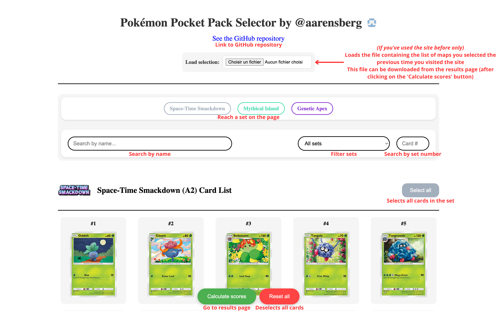
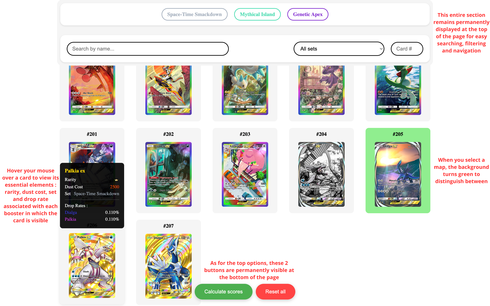
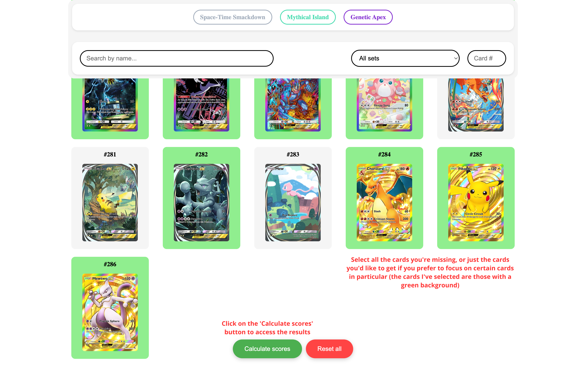
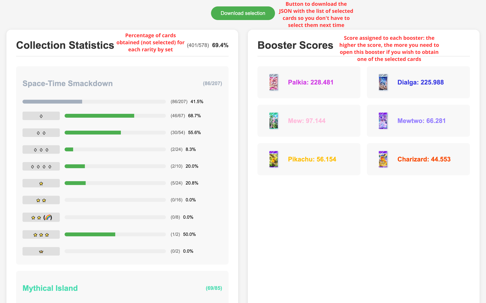
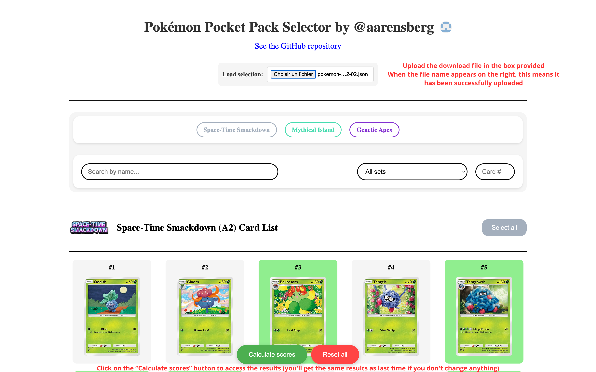

# https://aarensberg.github.io/pokemon-pocket-pack-selector/

<h1 align="center">
  <br>
  <a href="https://tcgpocket.Pokemon.com/es-es/"></a>
  <br>
  Pokémon Pocket Pack Selector 📱
  <br>
  <h4 align="center">A <a href="https://aarensberg.github.io/pokemon-pocket-pack-selector/">web application</a> that calculates the score of each booster based on desired cards.
</h4>

<p align="center">
  <a>
    
  </a>
  <a href="https://opensource.org/licenses/MIT">
    
  </a>
</p>
</h1>

## Description:

This application helps Pokémon Pocket players optimize their booster purchases by:
- **Calculating scores for each booster** according to the desired cards
- The calculated score **takes into account the drop rate** of the cards **as well as their dust cost** in order to weight the easily craftable cards
- The application also lets you **keep track of your collection** by displaying your progress in the Pokédex




## 🚀 Usage

### First Time Use
1. Go to **https://aarensberg.github.io/pokemon-pocket-pack-selector/**
2. **Select** the cards you want to obtain
3. Use filters to **search** for specific cards:
   - By name
   - By expansion
   - By card number
4. **Click "Calculate scores"** to see detailed results
5. On the results page, **click "Download selection"** to save your selection




### Subsequent Uses
1. Access the application
2. Under the title, **click "Load selection"** and select your file
3. Your previously selected cards will be automatically loaded
4. **Modify your selection** if needed
5. **Calculate new scores** and **save again** if needed



## 📁 Project Structure

```
pokemon-booster-selector/
├── assets/
│   ├── data/
│   │   └── cards.json        # Card data
│   └── image/                # Cards and icons images
├── css/
│   └── style.css            # Application styles
├── js/
│   ├── app.js               # Business logic and calculations
│   └── ui.js                # User interface
└── index.html               # Main page
```